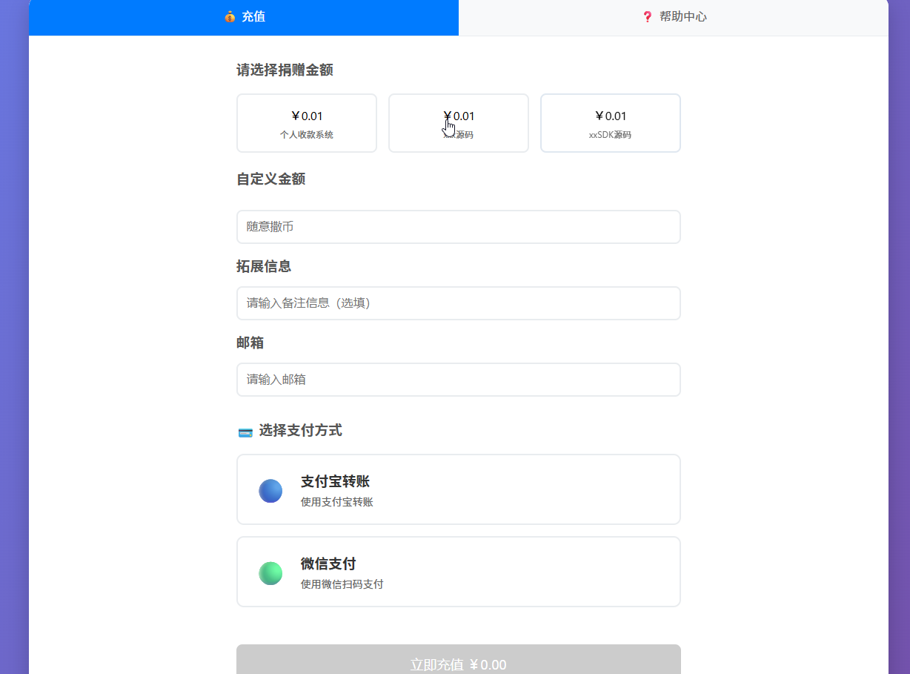
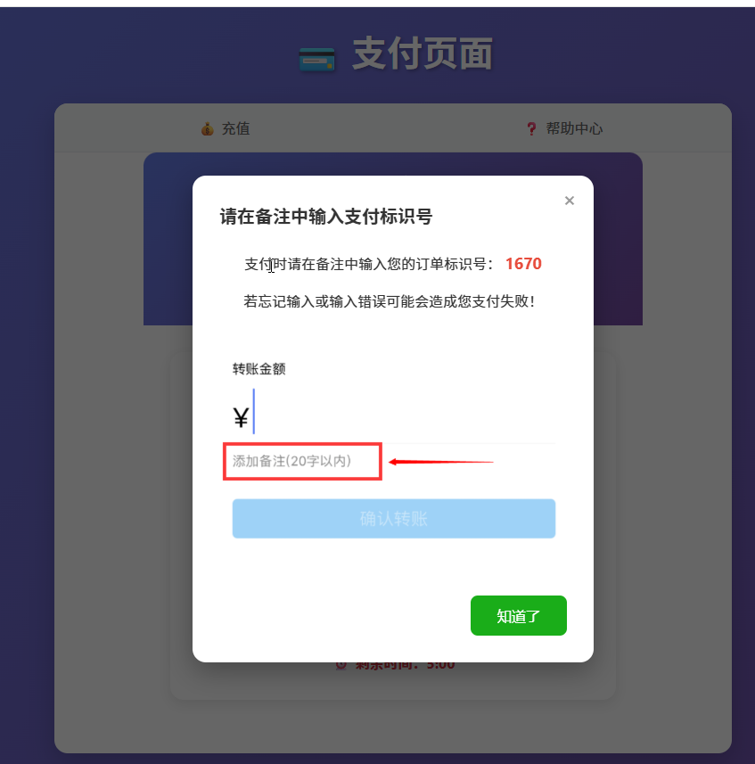
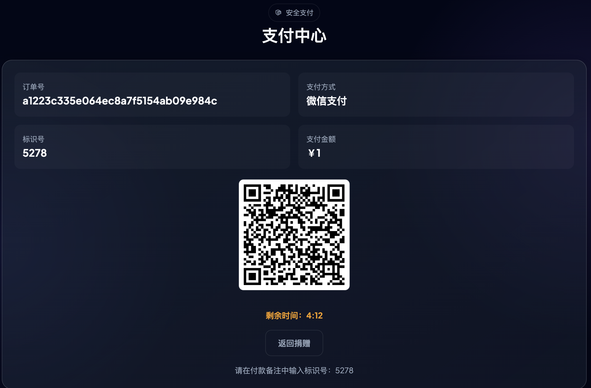
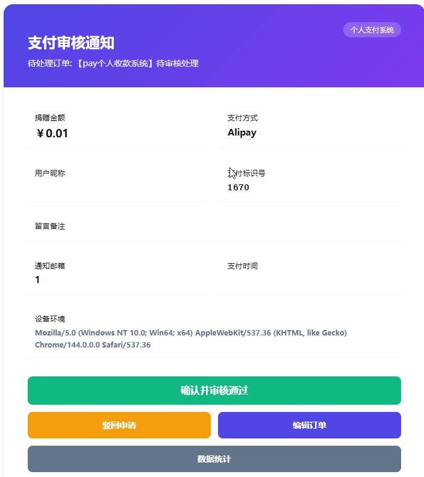

# PayPro - 个人支付系统

一个专为个人和小微商户设计的智能收款系统，无需签约第三方，支持全自动/半自动收款。

## 📋 项目简介

PayPro是一个零门槛的个人支付解决方案，帮助个人开发者和小微商户快速实现收款功能，无需复杂的企业资质和第三方签约流程。系统支持多种支付方式，实现全自动化收款，让收款变得简单高效。

## 演示地址
高级版：https://paypro.codewendao.com

邮箱支持：codewendao@163.com

| 功能特性 | 开源版 | 高级版 |
|---------|--------|--------|
| 基础备注支付功能 | ✅ | ✅ |
| 支付宝免输备注 | ✅ | ✅ |
| 微信支付自动确认 | ❌ | ✅ |
| 支付宝当面付 | ❌ | ✅ |


## ✨ 核心功能

### 🚀 基础功能
- **零门槛接入**：无需企业资质，无需繁琐的第三方支付签约流程
- **全自动收款**：智能识别到账，实时更新订单状态
- **半自动模式**：支持手动确认，灵活切换
- **多种支付方式**：支付宝、微信支付、微信赞赏码、支付宝当面付
- **实时到账**：每笔交易金额实时直达个人账户
- **零手续费**：无中间环节，无额外费用

### 💳 支付功能
- **充值系统**：支持预设金额和自定义金额充值
- **独立支付页面**：二维码展示和实时状态监控
- **支付审核**：邮件审批+备注对账机制
- **手动对账**：支持人工确认模式，确保交易准确

### 🎨 用户体验
- **现代化界面**：深色主题，专业美观的UI设计
- **响应式布局**：完美适配各种屏幕尺寸
- **智能交互**：流畅的动画效果和用户反馈
- **帮助中心**：支付相关帮助信息和FAQ

### 📊 管理功能
- **实时统计**：详细的收款记录和数据报表
- **订单管理**：完整的订单生命周期管理
- **状态监控**：实时监控支付状态和系统运行情况

## 🛠 技术栈

### 前端技术
- **HTML5/CSS3/JavaScript**：基础前端技术
- **Vue 3**：前端框架（CDN引入）
- **Tailwind CSS**：现代化CSS框架
- **Font Awesome**：图标库
- **Plus Jakarta Sans**：现代无衬线字体

### 后端技术
- **Java**：后端开发语言
- **Spring Boot**：Java开发框架
- **MyBatis**：ORM框架
- **Redis**：缓存系统
- **MySQL**：关系型数据库

### 支付技术
- **支付宝**：转账和扫码支付
- **微信支付**：扫码支付、赞赏码支付
- **邮件通知**：支付审核和状态通知

## 📦 快速开始

### 环境要求
- **JDK 1.8+**：Java开发环境
- **MySQL 5.7+**：关系型数据库
- **Redis 5.0+**：缓存系统
- **Maven 3.6+**：项目构建工具

### 安装步骤

1. **构建项目**
   ```bash
   mvn clean package -DskipTests
   ```
   
## 🏗 系统架构

### 前端架构
- **单页应用**：基于Vue 3的前端页面
- **响应式设计**：适配PC、平板、手机等各种设备
- **组件化开发**：模块化的前端组件
- **状态管理**：轻量级状态管理

### 后端架构
- **分层架构**：Controller → Service → Mapper
- **RESTful API**：标准的REST接口
- **事务管理**：确保数据一致性
- **异常处理**：统一的异常处理机制

### 支付流程
1. **用户下单**：用户选择金额和支付方式
2. **生成订单**：系统创建订单并生成支付信息
3. **展示二维码**：用户扫描二维码进行支付
4. **支付确认**：系统通过邮件审核或自动识别确认支付
5. **订单完成**：更新订单状态并通知用户

## ⚙️ 配置说明

### 核心配置项

**数据库配置**
```yaml
spring:
  datasource:
    url: jdbc:mysql://localhost:3306/paypro?useUnicode=true&characterEncoding=utf-8&useSSL=false&serverTimezone=Asia/Shanghai
    username: root
    password: 123456
    driver-class-name: com.mysql.cj.jdbc.Driver
```

**Redis配置**
```yaml
spring:
  redis:
    host: localhost
    port: 6379
    password: 
    database: 0
```

**邮箱配置**
```yaml
mail:
  host: smtp.qq.com
  port: 587
  username: your-email@qq.com
  password: your-email-password
  from: your-email@qq.com
  to: admin-email@qq.com
```

**系统配置**
```yaml
paypro:
  token: your-secret-token
  domain: http://localhost:8080
  qr-code-path: /path/to/qr-codes
```

## 📖 使用指南

### 1. 上传收款码
- 准备支付宝和微信支付的收款二维码
- 上传二维码图片到resource下的指定目录，支付宝方在alipay，微信wechat，微信赞赏码wechat_zs

### 2. 创建订单
- 访问 `recharge.html` 页面
- 选择预设金额或输入自定义金额
- 选择支付方式（支付宝/微信支付）
- 点击按钮支付

### 3. 完成支付
- 扫描生成的二维码进行支付
- 按照提示填写备注信息（如果需要）
- 完成支付后等待系统确认

### 4. 查看订单
- 访问 `history.html` 页面
- 查看所有订单记录和状态
- 支持订单搜索和筛选

## 📁 项目结构

```
src/
├── main/
│   ├── java/com/wendao/
│   │   ├── common/          # 通用工具类
│   │   ├── config/          # 系统配置
│   │   ├── controller/      # 控制器
│   │   ├── dto/             # 数据传输对象
│   │   ├── entity/          # 实体类
│   │   ├── enums/           # 枚举类
│   │   ├── mapper/          # 数据访问层
│   │   ├── model/           # 数据模型
│   │   ├── service/         # 业务逻辑层
│   │   └── PayApplication.java  # 应用入口
│   ├── resources/
│   │   ├── static/          # 静态资源
│   │   │   ├── assets/      # 图片、JS等资源
│   │   ├── templates/       # 前端页面
│   │   ├── application.yml  # 系统配置
│   │   └── db.sql           # 数据库脚本
├── test/                    # 测试代码
├── pom.xml                  # Maven配置文件
```

### 前端页面结构

```
templates/
├── error.html          # 错误页面
├── help.html           # 帮助中心页面
├── history.html        # 支付记录页面
├── home.html           # 首页（旧版）
├── home1.html          # 首页（新版，深色主题）
├── index.html          # 入口页面
├── order-del.html      # 订单删除页面
├── order-edit.html     # 订单编辑页面
├── order-fail.html     # 订单失败页面
├── order-success.html  # 订单成功页面
├── payment.html        # 支付页面
├── payment-review.html # 支付审核页面
├── recharge.html       # 充值页面
├── statistic.html      # 统计页面
└── success.html        # 成功跳转页面
```

## 📱 支付方式说明

### 1. 支付宝
- **方式**：扫码支付，免备注
- **优点**：操作简单，易于实现
- **适用场景**：个人收款，小额交易

### 2. 微信支付、赞赏码（高级版自动确认）
- **方式**：拼接二维码URL + 手动备注支付
- **优点**：覆盖面广，用户群体大
- **适用场景**：个人收款，社交场景

### 3. 支付宝当面付（高级版支持，免备注免手动对账）
- **方式**：个人免签，对接支付宝官方回调
- **优点**：无需手动备注，自动识别
- **适用场景**：自动确认的场景

## 🔧 部署建议

### 开发环境
- **本地服务器**：使用内置Tomcat
- **数据库**：本地MySQL
- **Redis**：本地Redis服务

### 生产环境
- **服务器**：Nginx + Tomcat
- **数据库**：独立MySQL服务器
- **缓存**：独立Redis集群
- **安全**：启用HTTPS，配置防火墙
- **监控**：配置服务器监控和日志管理

## ⚠️ 注意事项

1. **合法合规**：请确保您的使用符合相关法律法规
2. **安全防护**：定期更新系统，防止安全漏洞
3. **数据备份**：定期备份数据库，防止数据丢失
4. **网络环境**：确保服务器网络稳定，避免支付中断
5. **支付限额**：了解并遵守各支付平台的交易限额
6. **用户隐私**：保护用户支付信息和个人数据
7. **邮件配置**：确保邮件服务正常，避免支付审核延迟
8. **二维码安全**：定期更新收款二维码，防止被恶意替换

## 🛡️ 安全建议

- **使用HTTPS**：确保所有通信加密
- **强密码策略**：设置复杂的数据库和Redis密码
- **访问控制**：限制管理页面的访问权限
- **输入验证**：对所有用户输入进行严格验证
- **防SQL注入**：使用参数化查询，避免SQL注入
- **防XSS攻击**：对输出进行HTML转义
- **定期审计**：定期检查系统日志，发现异常行为

## 📞 技术支持

### 常见问题
- **支付失败**：检查网络连接，确认支付金额和备注是否正确
- **订单未确认**：检查邮件通知，确认是否需要手动审核
- **系统异常**：查看服务器日志，检查数据库和Redis连接

## 📸 效果展示

### 首页展示


### 支付选择


### 支付提示


### 支付页面


### 支付审核邮件


---

**PayPro** - 让收款变得简单高效！

*版本：1.0.0*
*最后更新：2026-02-15*